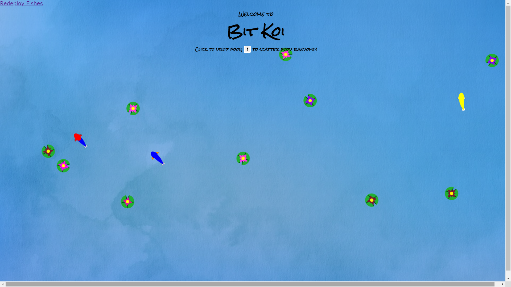
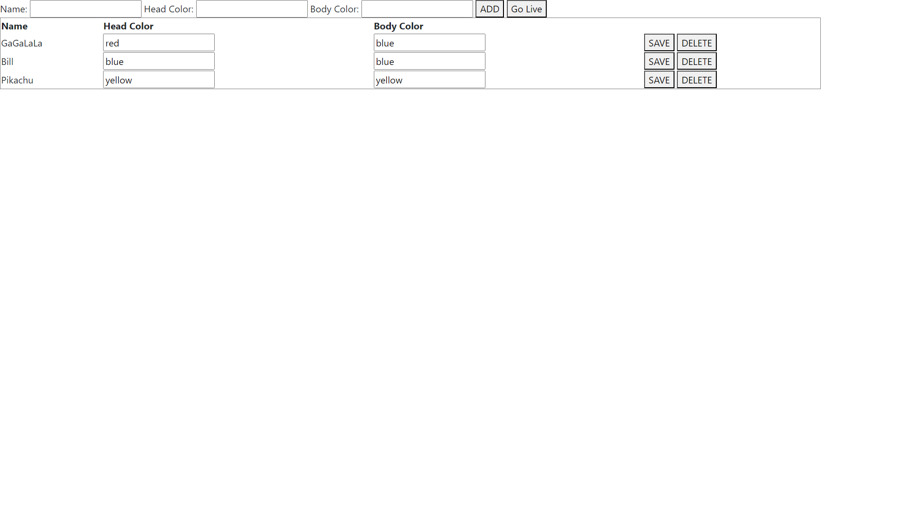
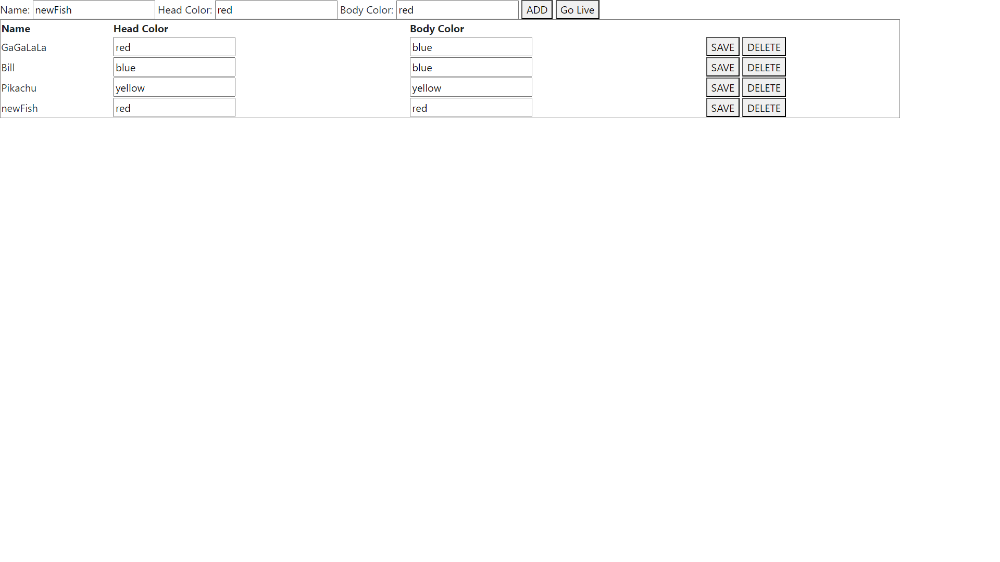
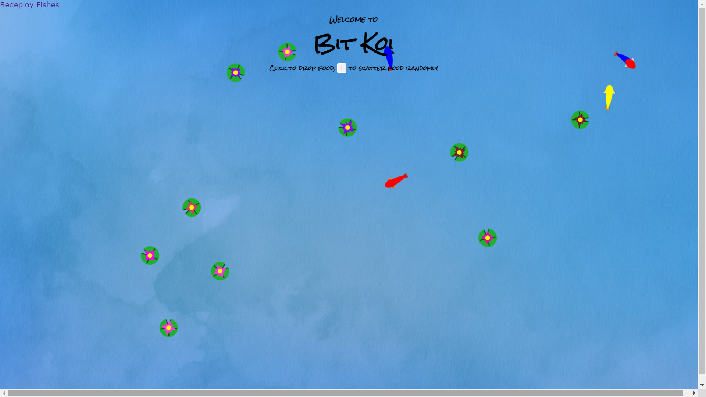

# FishPool
Java Spring Boot project

## The pool and the table at the first time 

## Add value in the table
Adding value by using the HTML input fields, the edit and delete features are the same.

